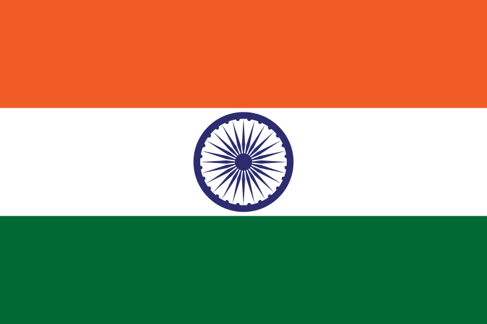

# Our India

---

# India Flag Project

This project is a simple representation of the Indian national flag using HTML and CSS. It displays the tricolor design with the Ashoka Chakra, just like the official flag of India.

## Introduction

The India Flag Project is a small web application that recreates the national flag of India using basic HTML and CSS. It's a beginner-friendly project that can help you practice your HTML and CSS skills while paying homage to the flag of our nation.

## Features

- Accurate representation of the Indian national flag colors and proportions.
- Ashoka Chakra depicted in the center of the flag.
- Responsive design, suitable for various screen sizes.

## Technologies used :
   1. HTML
   2. CSS
   3. JavaScript

## My Message to Other

I have an immense love for my beloved India, a nation rich in history, diversity, and culture. Our country has been shaped by remarkable individuals like Bhagat Singh, who fearlessly fought for freedom, leaving an indelible mark on our journey to independence. Their sacrifices and unyielding spirit inspire me to cherish the privilege of living in a free and sovereign nation. Today, our students stand as the beacon of hope and transformation. Their dedication, curiosity, and aspiration to achieve greatness in diverse fields motivate me to contribute positively to our country's growth. Just as our leaders and warriors paved the path to freedom, today's students are shaping a better future, and I am inspired to follow their lead and contribute my best to the nation I hold so dear.