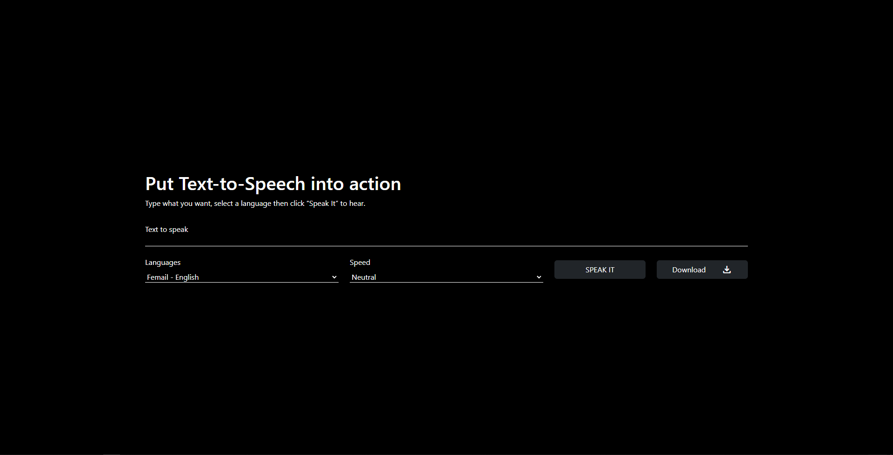

# VocalizeMe - Text-to-Speech Web App

VocalizeMe is a web application that allows you to convert text into speech using Text-to-Speech (TTS) technology. You can input text, select a language, adjust speech speed, and listen to the converted speech or download it as an audio file.

## Features

- **Text Input**: Type or paste the text you want to convert into speech.
- **Language Selection**: Choose from various languages for the speech output.
- **Speech Speed Control**: Adjust the speed of the speech output.
- **Play and Download**: Listen to the speech or download it as an audio file.
- **Error Handling**: Provides a warning message if you try to submit empty text.

## Built With

This web application was built using the following technologies and libraries:

- HTML5
- CSS3
- JavaScript
- [Bootstrap](https://getbootstrap.com/) - CSS framework
- [Axios](https://github.com/axios/axios) - HTTP client for making API requests

## How to Use

1. Enter the text you want to convert into
